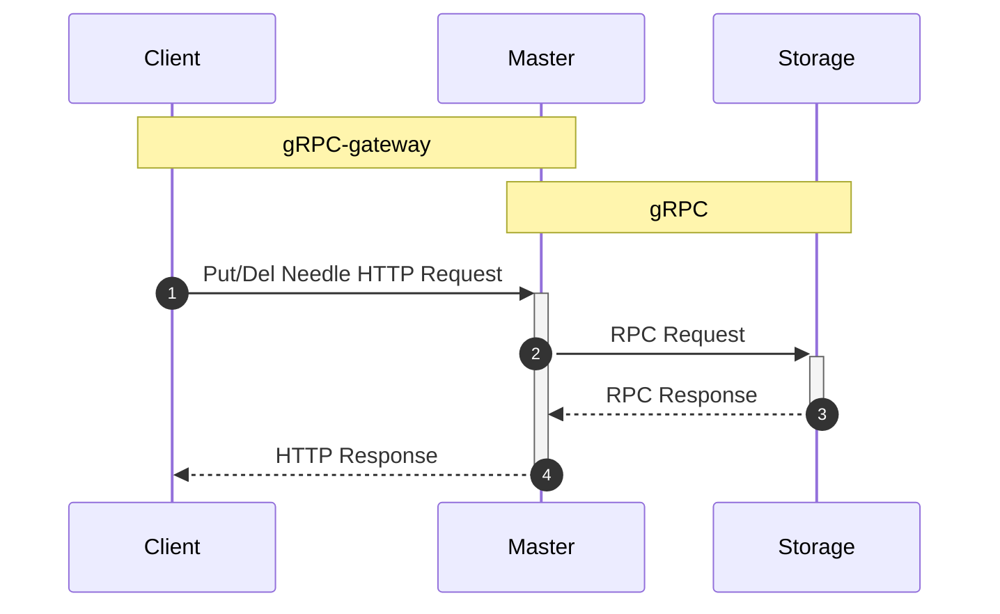
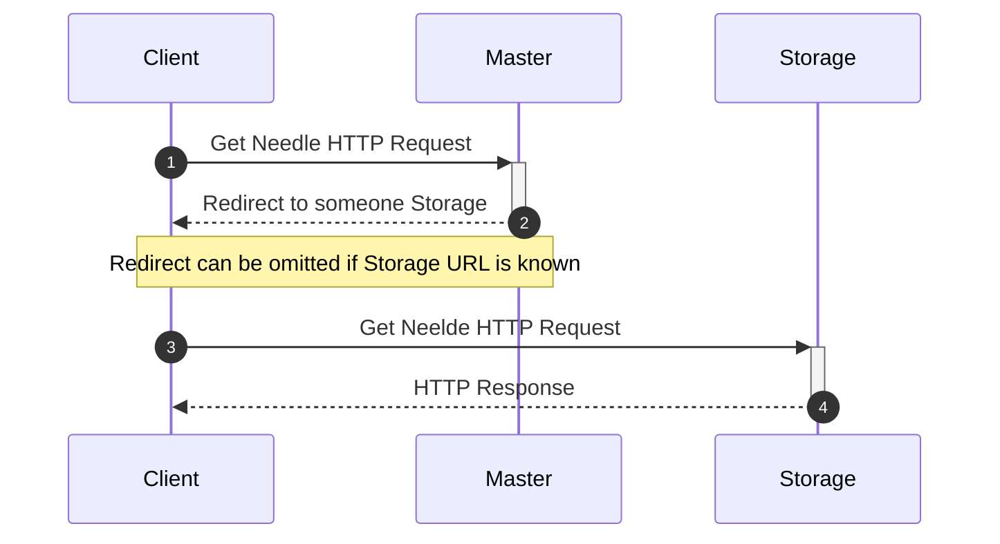
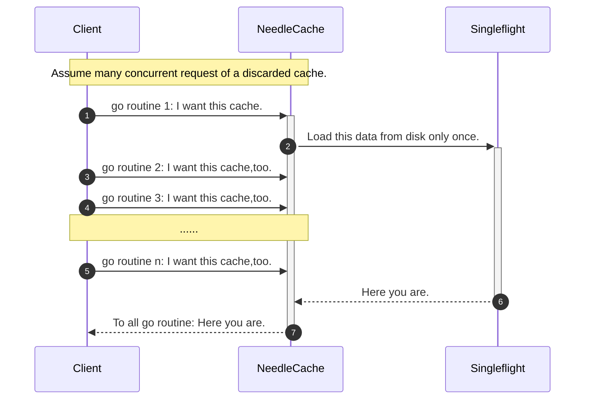
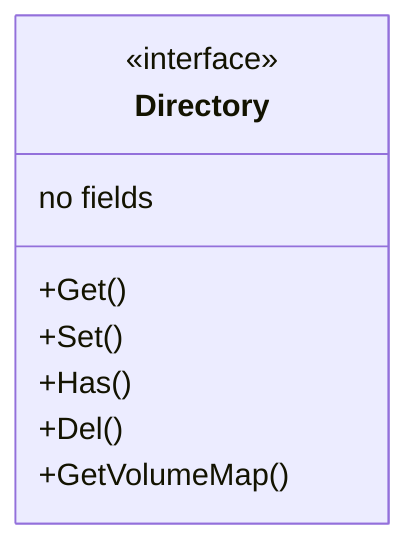
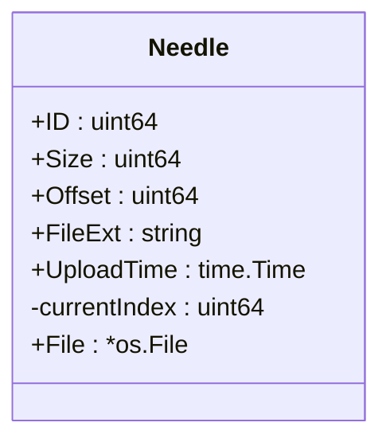

# Pie File System

A simple **massive small file** storage system based on [Facebook Haystack Paper](https://www.usenix.org/legacy/event/osdi10/tech/full_papers/Beaver.pdf).

Only for learning, **NOT RECOMMEND** to use for production environment (see [SeaweedFS](https://github.com/chrislusf/seaweedfs) instead).

### Why named 'Pie'?

Just like 'Finding a needle in Haystack', which is facebook's photo storage, a pie is a baked dish that contains a filling of various sweet or savoury ingredients (small files here).

## Document

### Features
- Master
    - HTTP API
      - [x] Put Needle
      - [x] Get Needle
    - gRPC Service
      - [x] Heartbeat
      - [x] Delete Needle
- Storage
  - [x] Cache
    - [x] Singleflight
  - [x] Directory
    - [x] LevelDB
  - [x] Volume
  - [x] Needle
  - [x] Heartbeat
  - HTTP API
    - [x] Get Needle
  - gRPC Service
    - [x] Add Volume
    - [x] Put Needle
    - [x] Delete Needle
- Utility
  - [x] Snowflake
---

### Usage

Edit your config.toml according instruction and just run.

```shell
#Upload File By Master
> curl -F 'file=@./resources/test/gofactory.jpg' 'localhost:8080/PutNeedle'
{"vid":1647868700846810400,"nid":1647920354875133400}
```
The master will auto hand off this file to several storage servers for replication.
```shell
#Get File By Master
GET localhost:8080/GetNeedle?vid=1647868700846810400&nid=1647920354875133400
```
Then the master will auto redirect you to physical file URL.
```shell
#Delete File By Master
> curl -d 'vid=1647868700846810400&nid=1647920354875133400' 'localhost:8080/DelNeedle'
success
```
Only delete this record from directory db.It will be physically deleted when compaction operation start.

### Outline
#### Upload/Delete Request

#### Get Request

#### Cache Singleflight

### Directory



A directory use Key-Value database (LevelDB now) to store the mapping relationship of one volume between needle id and needle metadata (map[vid]LevelDB<nid,n metadata> in short). 

### Volume
```mermaid
classDiagram
class Volume{
<<physical file struct>>
Current Index
Needle 1(offset 8,size x)
Needle 2(offset 8+x,size y)
.......(offset m,size n)
(End of file)
}
```
Each Volume file's first 8 bytes is its current offset, which means storage server can store data from here.

### Needle


The `currentIndex` is used for implementing `Reader` and `Writer` interfaces.
### Perfermance
```
Test on NVME 3.0 SSD
=== RUN   TestBenchmark
upload 100 102400byte file:

concurrent:             12
time taken:             0.06 seconds
completed:              100
failed:                 0
transferred:            10240000 byte
request per second:     1756.23
transferred per second: 171.51 MB 


read 100 102400byte file:

concurrent:             12
time taken:             0.06 seconds
completed:              100
failed:                 0
transferred:            10240000 byte
request per second:     1619.90
transferred per second: 158.19 MB 


delete 100 102400byte file:

concurrent:             12
time taken:             0.03 seconds
completed:              100
failed:                 0
transferred:            10240000 byte
request per second:     3289.73
transferred per second: 321.26 MB
--- PASS: TestBenchmark (0.15s)
```
## Reference

This repository references many great project or paper (including but not limited to code and design ideas), especially following:

[Facebook Haystack Paper](https://www.usenix.org/legacy/event/osdi10/tech/full_papers/Beaver.pdf)

[AlexanderChiuluvB/xiaoyaoFS - Github](https://github.com/AlexanderChiuluvB/xiaoyaoFS)

[chrislusf/seaweedfs - Github](https://github.com/chrislusf/seaweedfs)

[Golang implement Snowflake algorithm - CNBlogs](https://www.cnblogs.com/luozhiyun/p/14858240.html)

[hmli/simplefs - Github](https://github.com/hmli/simplefs)

[030io/whalefs - Github](https://github.com/030io/whalefs)

Really thanks!